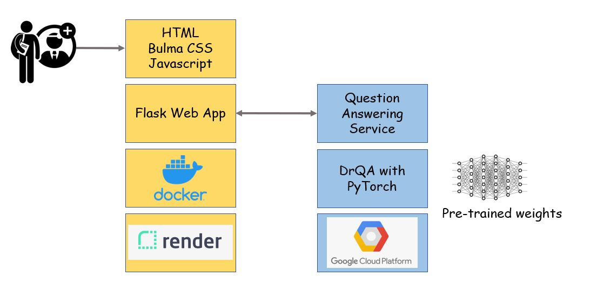
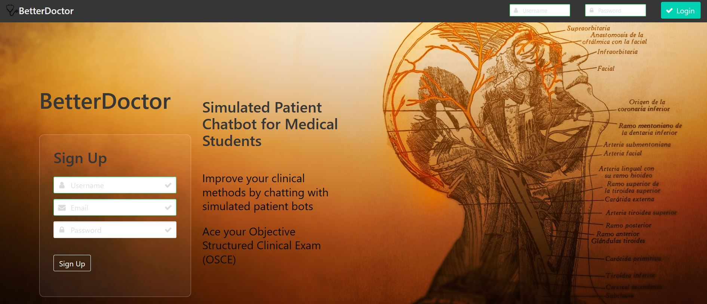
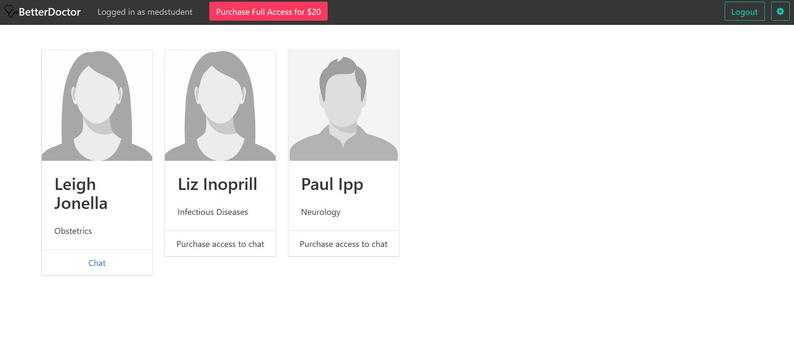
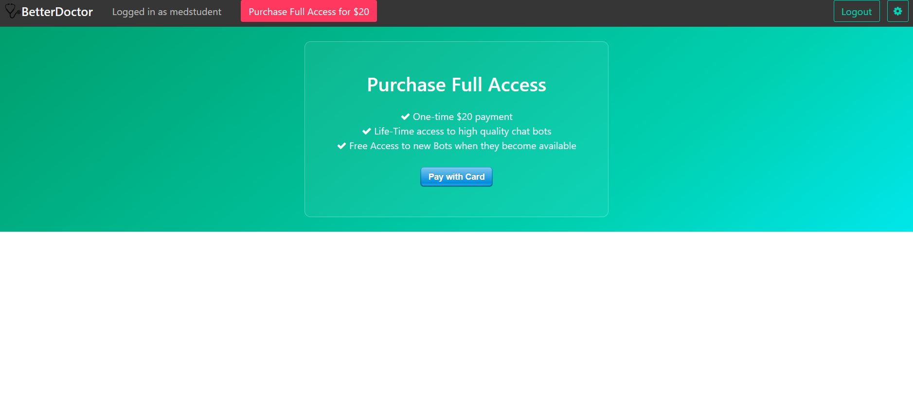
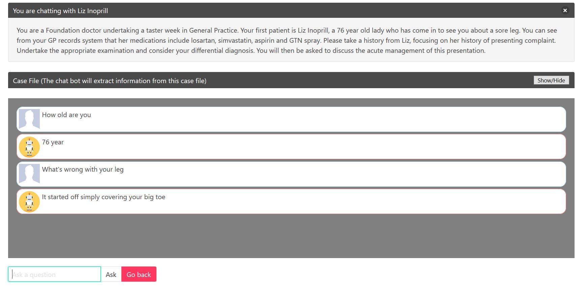

# BetterDoctor
## Simualted Patient Chatbot

The application simulates patient and doctor interaction by simulating patients with chat bots. 

The customer segment is medical students who want to continuously improve their clinical skills, anytime and anywhere.

Live running app: https://betterdoctor.onrender.com

## Pricing Model

The application follows a freemium model where the first chat bot is free, but users need to make a one-time purchase to access more chat-bots.

## DrQA

The application uses DrQA (https://github.com/facebookresearch/DrQA) question answering system built by Facebook.

DrQA is an open-domain question answering system which includes two sub-systems.
1. Document retrieval sub-system retrieves a sub-set of documents from the overall collection. 
2. Document reader sub-system uses a RNN (trained on SQuAD dataset) to read through the retreived documents and find the correct answer phrase for a given question.

For our use case, since the patient files are fixed, we discarded the document retrieval system and directly plugged-in our patient case file into the reader system.

## Architecture

## Set Up Procedure
1. Install docker and docker-compose
2. Run "docker-compose up". This will bring up the web applciation.
3. Follow DrQA installation guide from https://github.com/facebookresearch/DrQA#installing-drqa
4. Run qa_service.py to serve DrQA Reader system via webservice.

## Future Work

The application response can be improved by tuning the DrQA document reader RNN to medical question and answering texts.

The feature to bring and import patient cases by the medical students can be explored too.

## Screen Shots

### Login

### Home Page

### Payment

### Credit Card details

### Chat Interface

## Created By
Zay Yar (https://github.com/zayyarlin)

Matt (https://github.com/J-YT)

Jeff (https://github.com/jmitchel8)

Garry (https://github.com/gkuwanto)

## Credits and references

The patient cases are adapted from http://www.medisense.org.uk/. BetterDoctor application is a student prototype and is NOT for commercial use.

DrQA: https://github.com/facebookresearch/DrQA